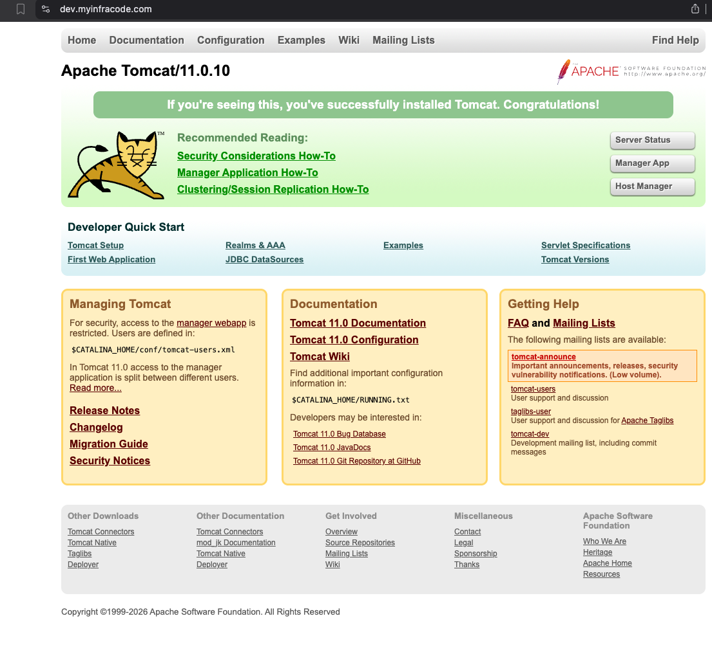
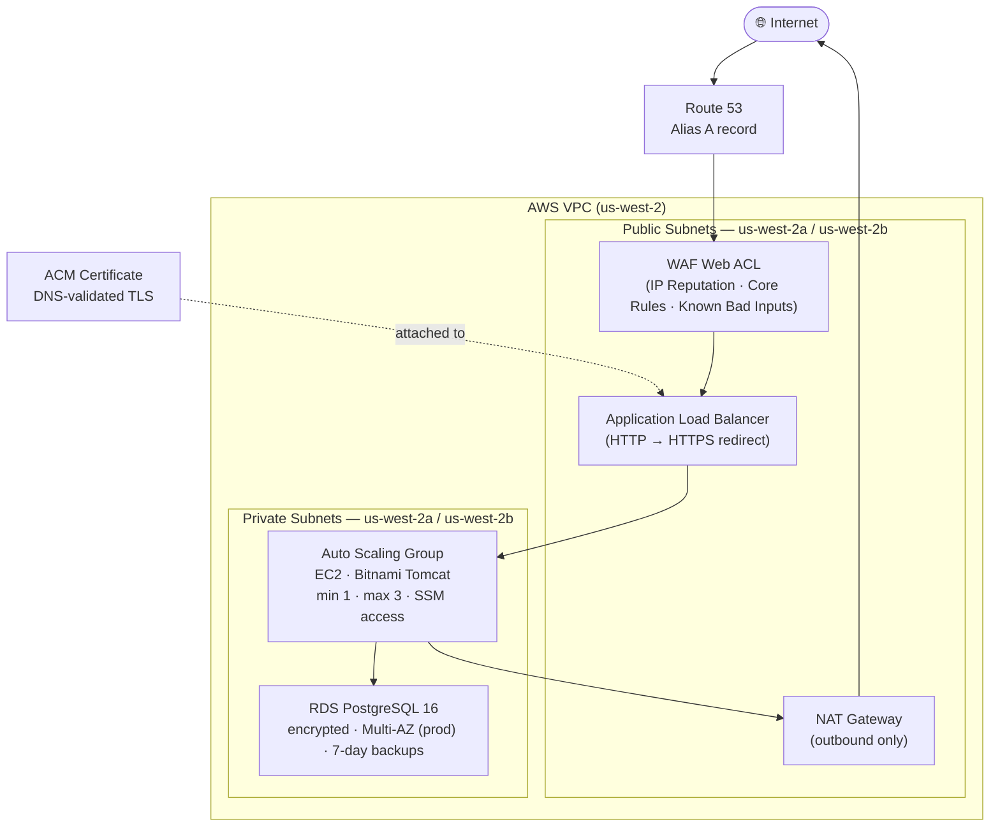

# terraform-aws-infra

Production-grade AWS infrastructure provisioned with Terraform. Implements a full 3-tier architecture — load balancer, compute, and database — across isolated dev and prod environments, with security, observability, and auto scaling built in from the start.

Live at **[myinfracode.com](https://myinfracode.com)** (prod) and **[dev.myinfracode.com](https://dev.myinfracode.com)** (dev).



---

## Architecture



### Traffic flow

```
Browser → Route 53 → WAF → ALB (HTTPS) → EC2 (private) → RDS (private)
                                              ↓
                                         NAT Gateway → Internet (outbound)
```

---

## Repository structure

```
.
├── bootstrap/               # One-time setup: S3 state bucket, DynamoDB lock, GitHub OIDC role
├── envs/
│   ├── dev/                 # dev environment  — t3.nano / db.t3.micro  / dev.myinfracode.com
│   └── prod/                # prod environment — t3.small / db.t3.small / myinfracode.com
├── modules/
│   ├── vpc/                 # VPC, subnets, IGW, NAT Gateway, route tables, VPC Flow Logs
│   ├── webserver/           # ASG, ALB, ACM, Route 53, IAM, CloudWatch, Auto Scaling policies
│   ├── rds/                 # RDS PostgreSQL, DB subnet group, security group, Secrets Manager
│   └── waf/                 # WAF v2 Web ACL, managed rule groups, CloudWatch logging
├── .github/
│   └── workflows/           # CI/CD: plan on PR, apply on merge to main
├── .pre-commit-config.yaml
└── docs/
    ├── onboarding.md
    └── assets/
```

---

## What it provisions

### Per environment

| Layer | Resource | Details |
|---|---|---|
| **Networking** | VPC | Custom CIDR, DNS hostnames and resolution enabled |
| | Public subnets (×2) | One per AZ — ALB and NAT Gateway |
| | Private subnets (×2) | One per AZ — EC2 instances and RDS |
| | Internet Gateway | Public subnet outbound/inbound |
| | NAT Gateway + EIP | Private subnet outbound-only internet access |
| | Route tables | Separate public (→ IGW) and private (→ NAT) routing |
| | VPC Flow Logs | All traffic logged to CloudWatch, 30-day retention |
| **Compute** | Launch Template | Bitnami Tomcat AMI, IAM profile, no public IP |
| | Auto Scaling Group | min 1 · max 3, private subnets, target group registered |
| | Scaling policies | CPU target tracking (50%) + ALB request count (1 000 req/target) |
| | IAM role | SSM Session Manager + CloudWatch agent + Secrets Manager access |
| **Load balancing** | Application Load Balancer | Public, multi-AZ, access logs enabled |
| | Listeners | HTTP (301 → HTTPS) and HTTPS (TLS 1.3) |
| | Target group | HTTP/80, health check on `/` |
| **TLS / DNS** | ACM certificate | DNS-validated, auto-renewed |
| | Route 53 records | Alias A record (ALB) + CNAME (cert validation) |
| **Security** | WAF Web ACL | Attached to ALB; three AWS managed rule groups (see below) |
| | Security group — ALB | HTTP/HTTPS from `0.0.0.0/0` only |
| | Security group — EC2 | HTTP from ALB SG only; no direct internet access |
| | Security group — RDS | Port 5432 from EC2 SG only |
| **Database** | RDS PostgreSQL 16 | Private subnets, encrypted at rest (gp3), no public access |
| | DB subnet group | Spans both private subnets |
| | Secrets Manager | Credentials stored as JSON; EC2 role grants `GetSecretValue` |
| **Observability** | CloudWatch log group | `/webserver-{env}/application`, 30-day retention |
| | CloudWatch alarms | CPU > 80% and unhealthy host count > 0 |
| | SNS topic | Email notifications for all alarms |

### Environment differences

| | dev | prod |
|---|---|---|
| Domain | `dev.myinfracode.com` | `myinfracode.com` |
| EC2 instance type | `t3.nano` | `t3.small` |
| RDS instance class | `db.t3.micro` | `db.t3.small` |
| RDS Multi-AZ | No | Yes |
| RDS deletion protection | No | Yes |
| RDS final snapshot | Skipped | Taken |

---

## Security layers

### WAF — three managed rule groups on the ALB

| Priority | Rule group | Blocks |
|---|---|---|
| 10 | `AWSManagedRulesAmazonIpReputationList` | Known malicious IPs, botnets, scrapers |
| 20 | `AWSManagedRulesCommonRuleSet` | SQLi, XSS, path traversal, protocol violations |
| 30 | `AWSManagedRulesKnownBadInputsRuleSet` | Log4Shell, Spring4Shell, SSRF probes |

WAF decisions are logged to `aws-waf-logs-{env}` in CloudWatch.

### Network isolation

- EC2 instances have no public IP — reachable only via ALB or SSM Session Manager
- RDS has no public access — reachable only from EC2 security group on port 5432
- VPC Flow Logs capture every connection (ACCEPT + REJECT) for forensics and debugging

### IAM least-privilege

- EC2 role has exactly three policies: `AmazonSSMManagedInstanceCore`, `CloudWatchAgentServerPolicy`, and an inline policy scoped to `secretsmanager:GetSecretValue` on the one RDS secret ARN
- No SSH keys used for access — SSM handles all shell sessions
- NAT Gateway provides outbound internet access without exposing instances inbound

---

## Remote state

State is stored in S3 with DynamoDB locking — each environment has an isolated state key:

| Environment | State key |
|---|---|
| dev | `envs/dev/terraform.tfstate` |
| prod | `envs/prod/terraform.tfstate` |

- Bucket: `terraform-aws-infra-state-<account-id>` (versioned, AES-256 encrypted, public access blocked)
- Lock table: `terraform-aws-infra-locks`

---

## CI/CD pipeline

All changes deploy through GitHub Actions — no manual `terraform apply` in production.

| Trigger | Workflow | Behaviour |
|---|---|---|
| Pull request → `main` | `terraform-plan.yml` | fmt check + validate + plan for dev and prod; posts plan as PR comment |
| Merge → `main` | `terraform-apply.yml` | Auto-applies dev; prod requires manual approval via GitHub environment protection |

Authentication uses OIDC — no long-lived AWS credentials stored as secrets.

---

## Getting started

### Prerequisites

- Terraform >= 1.0
- AWS CLI configured (`aws configure` or environment variables)
- A Route 53 hosted zone for your domain
- A GitHub repository (for CI/CD)

### 1. Bootstrap (first time only)

```bash
cd bootstrap
terraform init
terraform apply -var="github_repo=your-username/terraform-aws-infra"
```

This creates the S3 state bucket, DynamoDB lock table, and the GitHub Actions OIDC IAM role. Copy the `role_arn` output and add it as `AWS_ROLE_ARN` in your GitHub repository secrets.

See [docs/onboarding.md](docs/onboarding.md) for the full setup guide.

### 2. Deploy an environment

Create a `terraform.tfvars` file (gitignored) with your values:

```hcl
# envs/dev/terraform.tfvars
public_key  = "ssh-ed25519 AAAA..."
alarm_email = "you@example.com"
```

Then:

```bash
cd envs/dev
terraform init
terraform apply
```

### 3. Access your instance

No SSH required — use SSM Session Manager:

```bash
aws ssm start-session --target <instance-id>
```

### 4. Retrieve database credentials

```bash
aws secretsmanager get-secret-value \
  --secret-id dev/rds/app \
  --query SecretString \
  --output text | jq .
```

Returns:

```json
{
  "engine":   "postgres",
  "host":     "dev-db.<id>.us-west-2.rds.amazonaws.com",
  "port":     5432,
  "dbname":   "app",
  "username": "appuser",
  "password": "<auto-generated>"
}
```

---

## Key design decisions

**Private subnets for compute and data.** EC2 instances and RDS live in private subnets with no public IPs. The only public-facing resources are the ALB and NAT Gateway. This minimises the attack surface without sacrificing operability — SSM handles all shell access.

**Target tracking over step scaling.** Auto Scaling policies use target tracking (CPU 50%, 1 000 ALB req/target). AWS continuously adjusts capacity to maintain the target rather than reacting to thresholds in steps, which produces smoother scaling behaviour with less tuning.

**Secrets Manager over Parameter Store for credentials.** RDS passwords are stored as structured JSON in Secrets Manager. The EC2 IAM role is granted `GetSecretValue` scoped to that one secret ARN — no credentials in environment variables, user data, or AMIs.

**WAF managed rules over custom rules.** AWS managed rule groups are maintained by the AWS Threat Intelligence team and updated automatically. Custom rules would require ongoing maintenance and threat research. Managed rules cover the OWASP Top 10 and current exploit signatures out of the box.

**One NAT Gateway per environment.** A single NAT Gateway is sufficient for dev and acceptable for prod at this scale. Multi-AZ NAT Gateways (one per AZ) would eliminate the AZ dependency for outbound traffic — a worthwhile upgrade for high-availability prod workloads.

**Reusable modules with explicit contracts.** Each module exposes only the inputs it needs and outputs only what consumers require. Environments wire modules together at the `envs/` layer, keeping the modules themselves environment-agnostic.
